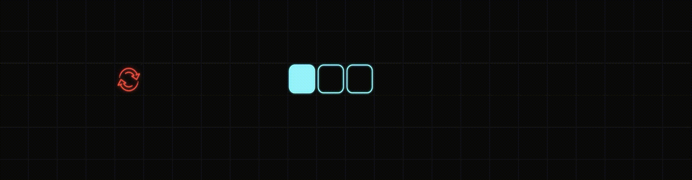

# snake2d_game

Snake game in neon style, with 2 types of food:
* Normal food : just increasing your snake size.
* Reverse food : reversing a snake and force movement to another direction.



## You will need
* [CMake](https://cmake.org/install/)
* [VCPKG](https://vcpkg.io/en/)
* COMPILER(gcc,clang,MSVC)
  
## Basic Build Instructions (For VisualStudio)
1. Clone this repo to your folder with `git clone https://github.com/cah9xddd/snake2d_game.git`
2. Run CMake as follows:
⚠️ **Do not forget to replace `[path_to_vcpkg]` with the actual path to vcpkg on your machine!**
```bash
cmake -Bbuild -G "Visual Studio 17 2022" -DCMAKE_TOOLCHAIN_FILE=[path_to_vcpkg]/scripts/buildsystems/vcpkg.cmake

3. Open the generated solution file in Visual Studio:
   - Navigate to the "build" directory in File Explorer.
   - Double-click on the `snake_game.sln` file to open it in Visual Studio.

4. Build the project:
   - Once the solution is open in Visual Studio, select the desired build configuration (e.g., Debug or Release) from the toolbar.
   - Click on the "Build" menu and then select "Build Solution" to compile the project.
   - Alternatively, you can use the keyboard shortcut Ctrl+Shift+B to build the solution.

5. Run the game:
   - After the build process completes successfully, you can run the game executable from the output directory.
   - The executable file is typically located in the "build" directory or a subdirectory within it, depending on your project configuration.
