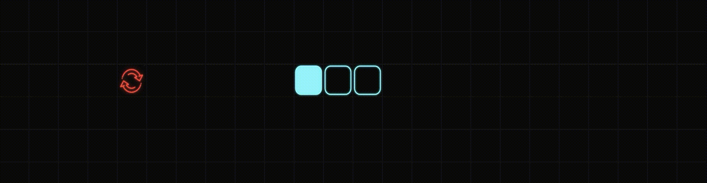

# snake2d_game

Snake game in neon style, with 2 types of food:
* Normal food : just increasing your snake size.
* Reverse food : reversing a snake and force movement to another direction.

## You will need
* [CMake](https://cmake.org/install/)
* Make or Ninja
* [SDL2](https://wiki.libsdl.org/Installation)
* gcc/g++
  
## Basic Build Instructions
1. Clone this repo to your folder with `git clone https://github.com/cah9xddd/snake2d_game.git`
2. Make a build directory in the top level directory :
  * Linux : `mkdir build && cd build`; 
  * Windows : `mkdir build; cd build`;
3. Compile : 
* Linux : `cmake .. && cmake --build .`;
* Windows : currently not supporting MSVC so u must use Ninja or Unix Makefiles or similar , like :
  * `cmake .. -G "Ninja"; cmake --build .`
  * `cmake .. -G "Unix Makefiles"; cmake --build .`
4. Run it: 
* Linux : `./snake_game`.
* Windows : `.\snake_game`
